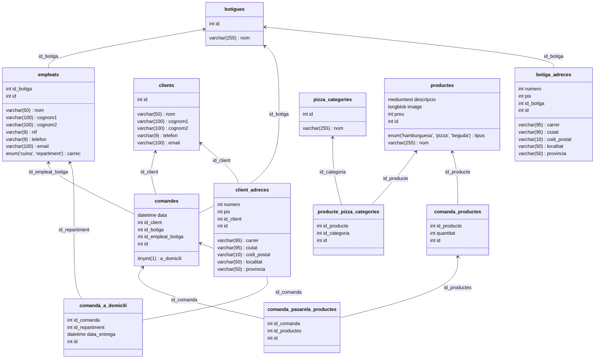

```mermaid
classDiagram
direction BT
class botiga_adreces {
   varchar(95) carrer
   int numero
   int pis
   varchar(95) ciutat
   varchar(10) codi_postal
   varchar(50) localitat
   varchar(50) provincia
   int id_botiga
   int id
}
class botigues {
   varchar(255) nom
   int id
}
class client_adreces {
   varchar(95) carrer
   int numero
   int pis
   varchar(95) ciutat
   varchar(10) codi_postal
   varchar(50) localitat
   varchar(50) provincia
   int id_client
   int id
}
class clients {
   varchar(50) nom
   varchar(100) cognom1
   varchar(100) cognom2
   varchar(9) telefon
   varchar(100) email
   int id
}
class comanda_a_domicili {
   int id_comanda
   int id_repartiment
   datetime data_entrega
   int id
}
class comanda_pasarela_productes {
   int id_comanda
   int id_productes
   int id
}
class comanda_productes {
   int id_producte
   int quantitat
   int id
}
class comandes {
   datetime data
   int id_client
   int id_botiga
   int id_empleat_botiga
   tinyint(1) a_domicili
   int id
}
class empleats {
   varchar(50) nom
   varchar(100) cognom1
   varchar(100) cognom2
   varchar(9) nif
   varchar(9) telefon
   varchar(100) email
   enum('cuina', 'repartiment') carrec
   int id_botiga
   int id
}
class pizza_categories {
   varchar(255) nom
   int id
}
class producte_pizza_categories {
   int id_producte
   int id_categoria
   int id
}
class productes {
   enum('hamburguesa', 'pizza', 'beguda') tipus
   varchar(255) nom
   mediumtext descripcio
   longblob imatge
   int preu
   int id
}

botiga_adreces  -->  botigues : id_botiga
client_adreces  -->  clients : id_client
comanda_a_domicili  -->  comandes : id_comanda
comanda_a_domicili  -->  empleats : id_repartiment
comanda_pasarela_productes  -->  comanda_productes : id_productes
comanda_pasarela_productes  -->  comandes : id_comanda
comanda_productes  -->  productes : id_producte
comandes  -->  botigues : id_botiga
comandes  -->  clients : id_client
comandes  -->  empleats : id_empleat_botiga
empleats  -->  botigues : id_botiga
producte_pizza_categories  -->  pizza_categories : id_categoria
producte_pizza_categories  -->  productes : id_producte
```
