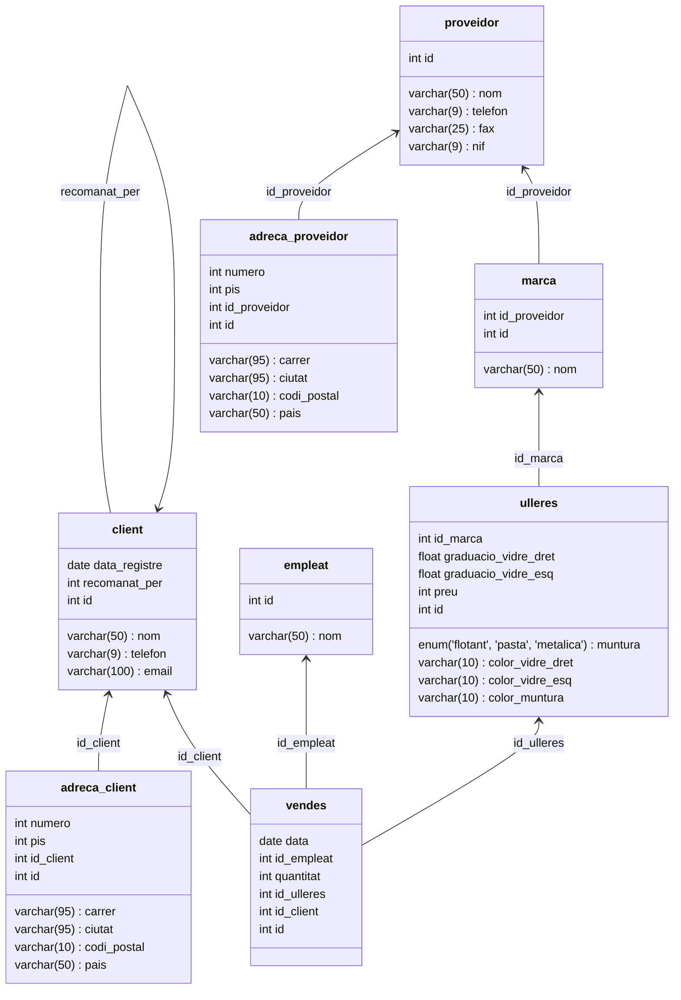

```mermaid
classDiagram
direction BT
class adreca_client {
   varchar(95) carrer
   int numero
   int pis
   varchar(95) ciutat
   varchar(10) codi_postal
   varchar(50) pais
   int id_client
   int id
}
class adreca_proveidor {
   varchar(95) carrer
   int numero
   int pis
   varchar(95) ciutat
   varchar(10) codi_postal
   varchar(50) pais
   int id_proveidor
   int id
}
class client {
   varchar(50) nom
   varchar(9) telefon
   varchar(100) email
   date data_registre
   int recomanat_per
   int id
}
class empleat {
   varchar(50) nom
   int id
}
class marca {
   varchar(50) nom
   int id_proveidor
   int id
}
class proveidor {
   varchar(50) nom
   varchar(9) telefon
   varchar(25) fax
   varchar(9) nif
   int id
}
class ulleres {
   int id_marca
   float graduacio_vidre_dret
   float graduacio_vidre_esq
   enum('flotant', 'pasta', 'metalica') muntura
   varchar(10) color_vidre_dret
   varchar(10) color_vidre_esq
   varchar(10) color_muntura
   int preu
   int id
}
class vendes {
   date data
   int id_empleat
   int quantitat
   int id_ulleres
   int id_client
   int id
}

adreca_client  -->  client : id_client
adreca_proveidor  -->  proveidor : id_proveidor
client  -->  client : recomanat_per
marca  -->  proveidor : id_proveidor
ulleres  -->  marca : id_marca
vendes  -->  client : id_client
vendes  -->  empleat : id_empleat
vendes  -->  ulleres : id_ulleres
```